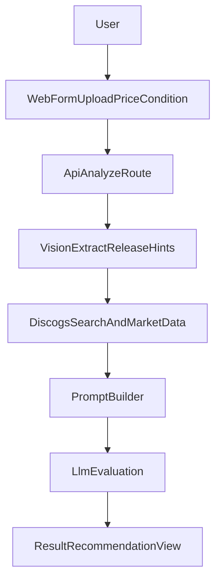

# Minimal Vinyl Evaluator MVP Plan

## Goal

Ship a tiny end-to-end prototype focused on **speed of validation**: upload photo, enrich with Discogs data, run LLM reasoning, and show a clear recommendation.

## Chosen Defaults

- Stack: **Next.js (TypeScript) full-stack** (fastest MVP path, one deploy unit).
- MVP mode: **no authentication**.
- Inputs: photo (required), asking price (optional), condition (optional dropdown).
- External keys you provide: Discogs API key/secret + LLM API key.

## Architecture (MVP)

## Implementation Plan

1. Bootstrap app shell and environment setup

- Initialize Next.js TypeScript app.
- Add `.env.local` support and validation for required keys.
- Add a minimal home page with upload form and result panel.

1. Build the analysis API route

- Create a server route that accepts multipart form data (`image`, `price`, `condition`).
- Add input validation and simple error states for missing/invalid fields.

1. Add release identification from image (best-effort)

- Use LLM vision to extract likely `artist`, `title`, and optional `catalog_number` from cover photo.
- Return low-confidence fallback when extraction is uncertain.

1. Integrate Discogs data retrieval

- Use extracted hints to call Discogs search.
- Pick top candidate and fetch key fields for MVP:
  - release title/artist/year/label
  - community rating + want/have counts
  - marketplace stats (lowest/median/highest when available)
  - optionally recent sale history if endpoint access allows

1. Implement LLM evaluation layer

- Construct a strict prompt with:
  - user inputs (`asking_price`, `condition`)
  - extracted metadata + confidence
  - Discogs market data
- Ask for structured JSON output:
  - `recommendation` (`buy`, `consider`, `skip`)
  - `fair_price_range`
  - `confidence`
  - `key_reasons` (3-5 bullets)
  - `risks`

1. Build minimal result UI

- Display release match, market stats, and recommendation card.
- Show transparent “why” bullets and confidence label.
- Add fallback UI when matching fails (ask user to retry with clearer photo).

1. Add basic hardening for MVP trials

- Rate-limit analyze endpoint lightly.
- Add request/response logging (without sensitive key data).
- Add a short disclaimer: “informational, not financial advice.”

1. Test plan and launch

- Manual test cases: clear cover, blurry cover, missing price, unknown release.
- Verify Discogs quota/error handling.
- Deploy to Vercel (or equivalent) with env vars.

## Suggested Initial File Map

- `[/Users/joachimdemuth/Documents/apps/should-i-buy/package.json](/Users/joachimdemuth/Documents/apps/should-i-buy/package.json)`
- `[/Users/joachimdemuth/Documents/apps/should-i-buy/.env.example](/Users/joachimdemuth/Documents/apps/should-i-buy/.env.example)`
- `[/Users/joachimdemuth/Documents/apps/should-i-buy/src/app/page.tsx](/Users/joachimdemuth/Documents/apps/should-i-buy/src/app/page.tsx)`
- `[/Users/joachimdemuth/Documents/apps/should-i-buy/src/app/api/analyze/route.ts](/Users/joachimdemuth/Documents/apps/should-i-buy/src/app/api/analyze/route.ts)`
- `[/Users/joachimdemuth/Documents/apps/should-i-buy/src/lib/discogs.ts](/Users/joachimdemuth/Documents/apps/should-i-buy/src/lib/discogs.ts)`
- `[/Users/joachimdemuth/Documents/apps/should-i-buy/src/lib/evaluator.ts](/Users/joachimdemuth/Documents/apps/should-i-buy/src/lib/evaluator.ts)`
- `[/Users/joachimdemuth/Documents/apps/should-i-buy/src/lib/types.ts](/Users/joachimdemuth/Documents/apps/should-i-buy/src/lib/types.ts)`

## MVP Success Criteria

- User can upload a photo and get a recommendation in one flow.
- App surfaces Discogs-derived pricing context + rationale.
- Failures are understandable and recoverable (no blank errors).
- Setup is simple enough to run locally with only env keys configured.

